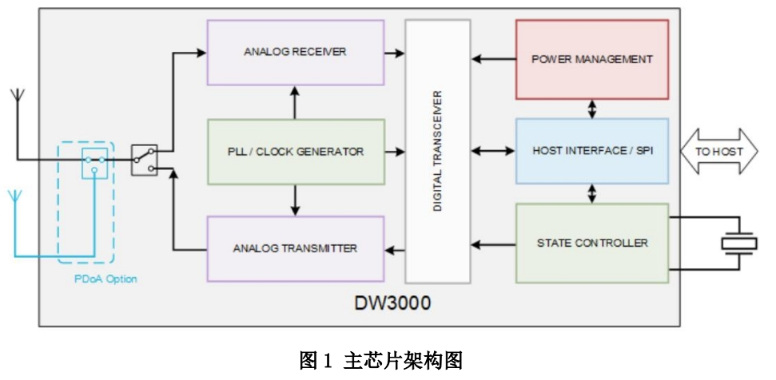
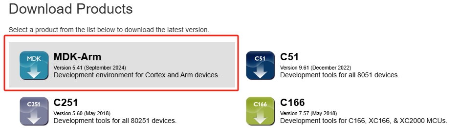
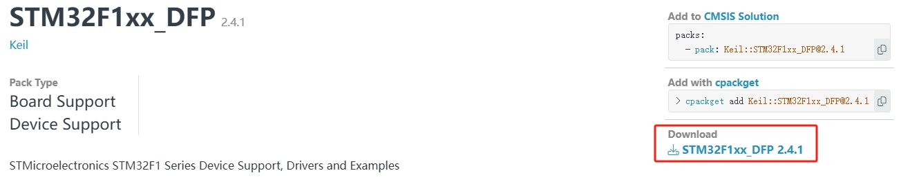
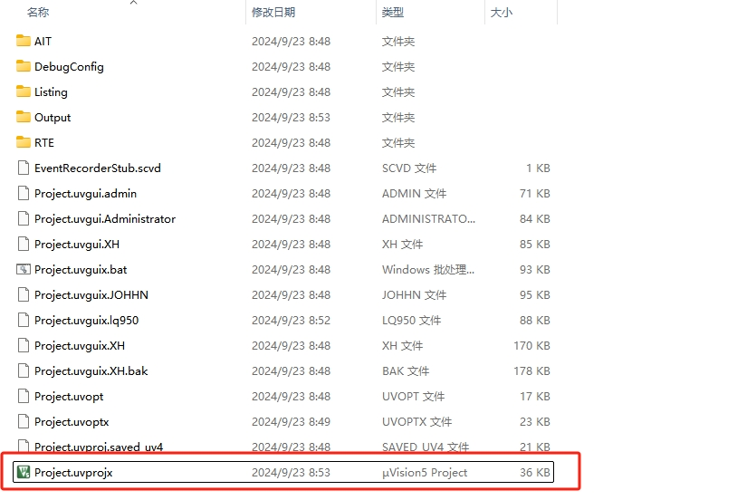
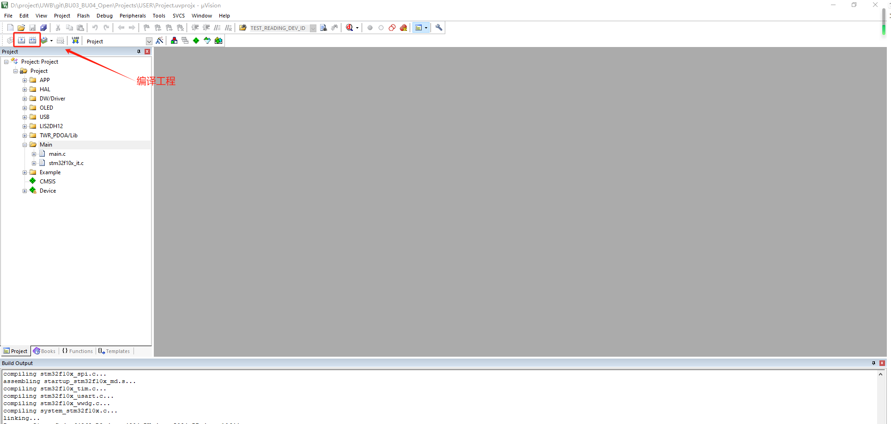
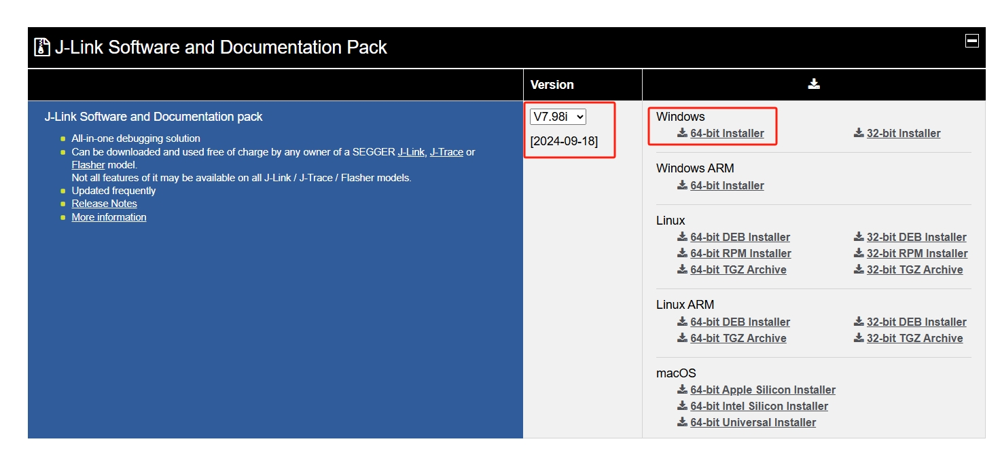
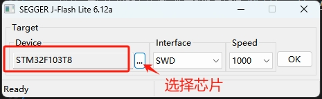
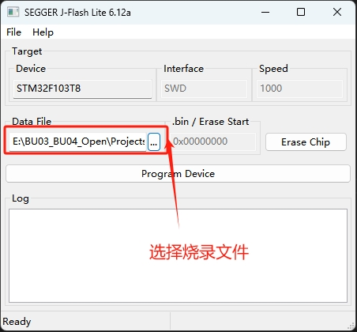
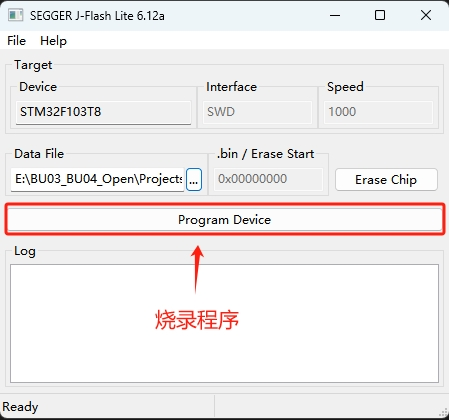

# 简介

BU03-Kit 是由深圳市安信可科技有限公司开发的一款 UWB 开发板。该开发板是基
于 BU03 收发模组，搭载一颗 ST 主控设计而成的一款测试评估板。其上的 BU03 模组
集成了板载天线，RF 电路，电源管理。 BU03-Kit 可以用于双向测距或 TDOA 定位系
统中，定位精度可达到 10 厘米，并支持高达 6.8 Mbps 的数据速率。可广泛应用于物
联网(IoT)、移动设备、可穿戴电子设备、智能家居等领域。如需开放所有代码，请联系安信可官方：<https://www.ai-thinker.com/>

## **温馨提示：** STM32F103-BU0x_SDK 只适用于安信可BU03或BU04系列模组或开发板

# 芯片架构



# 目录结构

| 文件夹| 描述 | 备注 |
| :-----------: | :---: | :---: |
| components         |  组件             | /|
| components/app     | 应用程序          | /   |
| doc                | 直到文档和图片     | /    |
| components/hal     | 驱动库            | / |
| components/main    | 入口函数          | /   |
| components/Examples | 示例例程 | / |
| projects           | 工程文档          | / |


# 环境搭建

使用Windows平台来搭建开发环境。

## keil mdk 下载

Keil MDK（Microcontroller Development Kit）是一个用于开发基于 ARM Cortex-M 系列微控制器的综合集成开发环境（IDE）。它包含代码编辑、编译、调试等工具，主要用于嵌入式系统开发。建议前去官方网站下载最新版本的mdk-arm:**<https://www.keil.com/download/product/>**



## keil mdk 安装完成

Keil MDK 安装完成后，用户将获得一个功能齐全的集成开发环境（IDE），用于开发基于 ARM Cortex-M 微控制器的嵌入式应用程序。


## stm32f1 keil扩展包 下载

STM32F1 Keil 扩展包是用于支持 STM32F1 系列微控制器的 Keil MDK 软件包，帮助开发人员在 Keil 环境中轻松开发基于 STM32F1 的嵌入式应用。扩展包包含设备相关的启动代码、驱动程序、示例代码以及其他开发资源。建议前去官方网站下载最新版本的扩展包:**<https://www.keil.arm.com/packs/stm32f1xx_dfp-keil/boards/>**



## stm32f1 keil扩展包 安装

STM32F1的Keil扩展包安装是STM32微控制器开发过程中的一个重要步骤，它允许开发者在Keil MDK-ARM这一集成开发环境（IDE）中方便地开发、编译和调试基于STM32F1系列微控制器的应用程序。


## SDK 克隆

### Github

```
git clone https://github.com/Ai-Thinker-Open/STM32F103-BU0x_SDK.git
```

### Gitee

```
git clone https://gitee.com/Ai-Thinker-Open/STM32F103-BU0x_SDK.git
```

## SDK 打开
    找到拉下来的工程，在\Projects\USER目录下面找到Project.uvprojx文件双击打开工程



## SDK 编译

    点击keil界面的编译按钮对工程进行编译



## 程序烧录

    程序烧录有多种方式，比如：keil烧录、ST link烧录、j-flash烧录等等等。这里选用j-flash烧录介绍。

### j-flash 下载

    JFlash 是 Segger 公司开发的一款用于编程和调试嵌入式系统闪存的工具软件，常用于对各种微控制器和存储器进行固件编程。
    建议前去官方网站下载对应版本的烧录软件:**<https://www.segger.com/downloads/jlink/>**



### j-flash 安装

    对下载的jflash进行安装，安装完成之后的j-flash界面。


### 打开j-flash lite软件

    打开j-flash lite软件


### j-flash lite 选择STM32F103T8芯片

    选择stm32f103t8芯片



### j-flash lite 加载烧录文件

    加载烧录文件



### j-flash lite 烧录

    烧录


